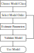

.. TimeSeries Toolbox documentation master file

TimeSeries Toolbox
==================

A Python toolbox for time series analysis and prediction modeling based on the
classical framework of **Box & Jenkins** (*Time Series Analysis: Forecasting and
Control*) and **Ljung** (*System Identification: Theory for the User*).

|

.. grid:: 2

   .. grid-item-card:: Getting Started
      :link: guide/installation
      :link-type: doc

      Install the package and run your first model in minutes.

   .. grid-item-card:: User Guide
      :link: guide/quickstart
      :link-type: doc

      Step-by-step walkthrough of the four-step Box-Jenkins workflow.

.. grid:: 2

   .. grid-item-card:: Example Notebooks
      :link: notebooks
      :link-type: doc

      Four fully-executed Jupyter notebooks with plots and output.

   .. grid-item-card:: API Reference
      :link: api/index
      :link-type: doc

      Auto-generated documentation of every public function and class.

----

.. toctree::
   :maxdepth: 2
   :caption: User Guide
   :hidden:

   guide/installation
   guide/quickstart
   guide/models
   guide/examples

.. toctree::
   :maxdepth: 1
   :caption: Example Notebooks
   :hidden:

   notebooks

.. toctree::
   :maxdepth: 1
   :caption: Function Reference
   :hidden:

   UserGuide

.. toctree::
   :maxdepth: 3
   :caption: API Reference
   :hidden:

   api/index

.. toctree::
   :maxdepth: 1
   :caption: About
   :hidden:

   changelog